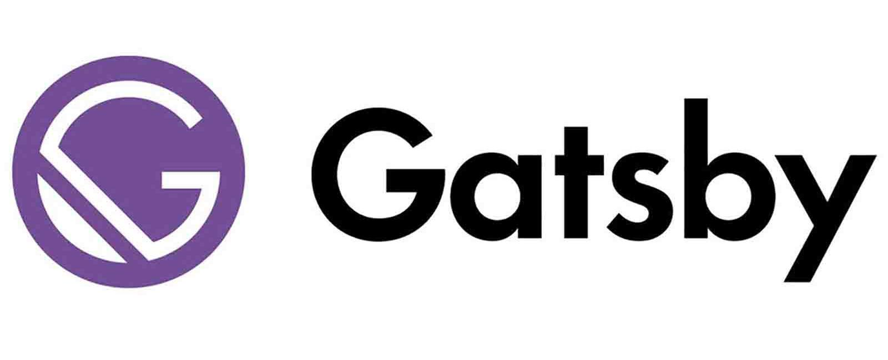

## 블로그를 만든 이유

평소 공부한 내용들을 주로 Notion에 기록해놓는데 다양한 이슈들과 해결방법들을 블로그에 작성해 기록하고 공유하고 싶어서 시작하게 되었습니다.

## What is Gatsby ?

**Gatsby**는 React를 활용한 JAM stack 기반의 정적 사이트 생성 프레임워크입니다.

<br>

### What is JAM stack ?

> "A modern web development architecture based on client-side JavaScript, reusable APIs, and prebuilt Markup"
> — Mathias Biilmann (CEO & Co-founder of Netlify).

JAM stack은 `JavaScript`, `API`, `Markup Stack` 세 가지 요소로 구성됩니다.

**JavaScript**

- 동적 기능들은 모두 JavaScript로 처리되고, 프레임워크나 라이브러리에는 제한이 없습니다.

**APIs**

- 서버의 동작이 필요한 부분은 재사용한 가능한 API로 추상화되며, JavaScript를 사용한 HTTPS를 통해 접근이 가능합니다.

**Markup**

- 웹사이트들은 Markup을 활용한 정적 HTML 파일들을 통해 제공됩니다.

<br>

JAM stack은 CSR(Client-Side Rendering) 이나 SSR(Server-Side Rendering) 과 같은 특정 기술보다는 **웹 사이트를 구축하는 하나의 서비스가 어떻게 구성되며 어떻게 동작이 되는지**와 같은 하나의 아키텍처에 가깝습니다.<br>

JAM stack은 웹 어플리케이션에서 렌더링 할 화면을 Pre-render하고 이를 CDN(Content Delivery Network)에서 제공하여 빠르고 안전한 앱으로 별도의 웹 서버를 관리하거나 사용할 필요가 없습니다.<br>

JAM stack은 다음과 같은 장점이 있습니다.

**Faster performance**

- CDN을 통해 사전 빌드된 파일을 제공합니다.

**More Secure**

- 데이터베이스의 취약성과 서버에 대한 걱정과 같은 보안 측면의 문제를 걱정할 필요 없습니다.

**Less expensive & Scalability**

- 배포된 파일을 제공해야 하는 사용자의 경우, 정적 파일로 제공되는 JAM stack 방식의 경우 필요한 호스팅 비용이 무료이거나 저렴합니다. 또, 확장이 필요한 경우 CDN을 통해서 쉽게 확장할 수 있습니다.

**Better developer experience**

- 별도의 서버 관리가 필요 없고, 개발에 보다 집중할 수 있기 때문에 좋은 사용자 경험을 제공합니다.

## Why Gatsby ?

사실 처음에는 Hexo로 블로그를 개설하려 하였으나 Hexo에 비해 다양한 플러그인, 다이나믹한 커스터마이징, 넓은 커뮤니티 등의 장점으로 Gatsby를 선택하게 되었습니다.
하지만 난이도는 Hexo에 비해 어려울 수 있고, 로딩속도나 배포속도는 Hexo에 비해 느립니다.

## 블로그 구축 과정

먼저 Gatsby로 블로그를 시작하게 되면서 처음부터 디자인을 하고, 구축하는 것은 오래걸릴 것 같기도 해서 다음의 [gatsby-starter-bee](https://github.com/JaeYeopHan/gatsby-starter-bee) 테마를 활용하여 블로그를 시작하게 되었습니다.
<br>

**1. 테마 설치하기**

```sh
npm install -g gatsby-cli # gatsby가 설치되어 있지 않다면.
gatsby new [블로그폴더명] https://github.com/JaeYeopHan/gatsby-starter-bee
```

**2. 패키지 설치**

> 패키지 설치 시, 특정 패키지로 인하여 node version이 14버전이어야 합니다. `nvm install 14.15.0`을 통해 14버전 설치 후, `nvm use 14.15.0`로 버전 변경 후 패키지를 설치해야 합니다.

```sh
cd [블로그폴더명]
npm install
```

**3. 실행하기**

`npm start` 명령어를 통해 http://localhost:8000 로 접속이 잘 되는지 확인합니다.
<br><br>
자세한 구성은 [해당 사이트](https://github.com/JaeYeopHan/gatsby-starter-bee)를 참고하시기 바랍니다.

## 마무리

Naver, velog, 티스토리와 같은 많은 블로그 플랫폼들이 있지만, 많은 개발자들이 개인 블로그를 직접 제작하여 만들고 싶어합니다. [Gatsby](https://www.gatsbyjs.com/), [Hexo](https://hexo.io/index.html) 와 같은 JAMstack 기반의 프레임워크가 다양하게 있으니 블로그를 직접 제작하여 만들어보는 것도 좋을 것 같습니다. ☺️

## References

- https://jamstack.org/
- https://jamstack.wtf/
- https://azderica.github.io/00-web-jamstack/
